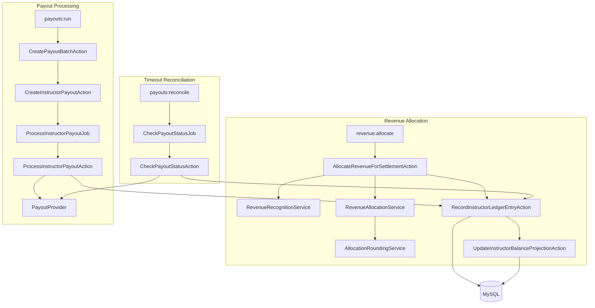

# Implementation Plan: Instructor Financial Core

**Branch**: `001-instructor-financial-core` | **Date**: 2026-06-10 | **Last amended**: 2026-06-10 (PATCH) | **Spec**: [spec.md](./spec.md)

**Input**: Feature specification from `specs/001-instructor-financial-core/spec.md`

## Plan Amendments (PATCH 2026-06-10)

- Replaced PostgreSQL-style partial unique index approach with MySQL 8 `active_snapshot_key`
  pattern on `payouts` (nullable unique index; multiple NULLs allowed).
- Documented `balance_snapshot_hash` and `active_snapshot_key` formulas and terminal-status
  clearing behavior.
- Added explicit v1 proration test requirements (full-month, partial-overlap, lifetime sum).
- Clarified engagement weight is `valid_watched_seconds` sum only — never record count.
- All prior constraints unchanged (custom Docker, no Sail, no refunds v1, no floats, etc.).

## Summary

Extend the existing Laravel 11 application with a focused **Instructor Financial Core**: monthly
settlement periods, day-based subscription revenue recognition, `valid_watched_seconds` allocation
with Largest Remainder rounding, append-only instructor ledger, rebuildable balance projections,
idempotent payout command/jobs, mock payout provider with timeout reconciliation, Pest tests, one
read-only Filament screen, and interview-ready documentation.

The project already runs in a **custom Docker environment** (app, nginx, mysql, redis, node).
No Laravel Sail. No full LMS UI. No refunds in v1.

## Technical Context

**Language/Version**: PHP 8.3 FPM (Laravel 11)

**Primary Dependencies**: Livewire v3, Filament v3, Redis (queues/cache), Pest 3, custom Docker

**Storage**: MySQL 8 (financial source of truth); Redis for queues/cache only

**Testing**: Pest — unit tests for services; feature tests for allocation, ledger, payouts, timeout

**Target Platform**: Docker Compose (`instructor-ledger-app`, `nginx:8080`, `mysql:3307`, `redis:6380`)

**Project Type**: Laravel monolith with light domain folders under `app/Domain/`

**Performance Goals**: Financial correctness and idempotency over throughput

**Constraints**:

- Integer minor units only; no floats
- Append-only ledger; balances are projections
- Provider calls outside DB transactions
- Artisan/Composer in `app` container; npm in `node` container
- Filament read-only only

**Scale/Scope**: Hiring-challenge financial core; demo seed data for 3 instructors / 1 subscription

## Constitution Check

*GATE: Must pass before Phase 0 research. Re-check after Phase 1 design.*

| Gate | Status | How plan satisfies |
|------|--------|-------------------|
| No floats for money | PASS | All amounts `bigInteger` minor units; `intdiv`/`%` only; optional `Money` helper |
| MySQL financial source of truth | PASS | All ledger, balances, payouts, allocations in MySQL |
| Redis queues/cache only | PASS | Queue driver Redis; no financial state in cache |
| Ledger append-only | PASS | Insert-only actions; no update/delete on ledger entries |
| Balances are projections | PASS | Derived from ledger; rebuildable command/test helper |
| Financial ops idempotent | PASS | Unique `idempotency_key` constraints + status checks |
| Provider calls outside transactions | PASS | `ProcessInstructorPayoutAction` calls provider after commit |
| Timeout = unknown, not failure | PASS | `pending_confirmation` + `CheckPayoutStatusJob` |
| No Laravel Sail | PASS | All commands use `docker compose exec app` |
| No full LMS/student UI | PASS | Seeders/factories for consumption only |
| Filament read-only | PASS | `canCreate`/`canEdit`/`canDelete` false; no payout actions |

**Post-design re-check**: All gates remain PASS. No Complexity Tracking violations.

## Project Structure

### Documentation (this feature)

```text
specs/001-instructor-financial-core/
├── plan.md
├── research.md
├── data-model.md
├── quickstart.md
├── contracts/
│   ├── artisan-commands.md
│   └── payout-provider.md
└── tasks.md              # Phase 2 — /speckit-tasks (not yet generated)
```

### Source Code (repository root)

```text
app/
├── Domain/
│   ├── Money/
│   │   └── Money.php                    # Optional value object (minor units + currency)
│   ├── Revenue/
│   │   ├── Actions/
│   │   │   └── AllocateRevenueForSettlementAction.php
│   │   ├── Services/
│   │   │   ├── RevenueRecognitionService.php
│   │   │   ├── RevenueAllocationService.php
│   │   │   └── AllocationRoundingService.php
│   │   └── Enums/
│   │       ├── SubscriptionStatus.php
│   │       ├── PaymentStatus.php
│   │       └── SettlementPeriodStatus.php
│   ├── Ledger/
│   │   ├── Actions/
│   │   │   ├── RecordInstructorLedgerEntryAction.php
│   │   │   └── UpdateInstructorBalanceProjectionAction.php
│   │   └── Enums/
│   │       ├── LedgerEntryType.php
│   │       └── LedgerDirection.php
│   └── Payouts/
│       ├── Actions/
│       │   ├── CreatePayoutBatchAction.php
│       │   ├── CreateInstructorPayoutAction.php
│       │   ├── ProcessInstructorPayoutAction.php
│       │   ├── CheckPayoutStatusAction.php
│       │   ├── MarkPayoutSucceededAction.php
│       │   ├── MarkPayoutFailedAction.php
│       │   └── MarkPayoutPendingConfirmationAction.php
│       ├── Jobs/
│       │   ├── ProcessInstructorPayoutJob.php
│       │   └── CheckPayoutStatusJob.php
│       ├── Contracts/
│       │   └── PayoutProvider.php
│       ├── Providers/
│       │   ├── MockPayoutProvider.php
│       │   └── FakePayoutProvider.php   # Deterministic for tests
│       ├── DTOs/
│       │   └── PayoutProviderResult.php
│       └── Enums/
│           ├── PayoutBatchStatus.php
│           ├── PayoutStatus.php
│           ├── PayoutAttemptStatus.php
│           └── ProviderResultStatus.php
├── Models/                              # Eloquent models (thin; no financial observers)
├── Console/Commands/
│   ├── RevenueAllocateCommand.php       # revenue:allocate
│   ├── PayoutsRunCommand.php            # payouts:run
│   └── PayoutsReconcileCommand.php      # payouts:reconcile
└── Filament/
    └── Resources/
        └── InstructorBalanceResource.php

database/
├── migrations/                          # Financial core tables
├── factories/
└── seeders/
    └── DemoFinancialCoreSeeder.php

tests/
├── Unit/Domain/Revenue/
│   ├── AllocationRoundingServiceTest.php
│   └── RevenueRecognitionServiceTest.php
├── Feature/Revenue/
│   └── AllocateRevenueTest.php
├── Feature/Ledger/
│   └── LedgerAndBalanceTest.php
├── Feature/Payouts/
│   ├── PayoutCommandTest.php
│   ├── PayoutJobRetryTest.php
│   └── PayoutTimeoutReconcileTest.php
└── Feature/Filament/
    └── InstructorBalanceResourceTest.php

docs/
├── ARCHITECTURE.md
└── AI_USAGE.md
```

**Structure Decision**: Single Laravel app at repo root. Financial logic lives in `app/Domain/{Money,Revenue,Ledger,Payouts}` for interview clarity. Eloquent models stay in `app/Models`. No `Refunds` domain in v1. No repository pattern.

## Architecture Overview



## Implementation Phases

### Phase 1: Schema, models, enums

**Goal**: Persist the financial core with correct constraints.

- Migrations for all tables (see [data-model.md](./data-model.md)); align `payouts` with:
  - `balance_snapshot_hash` (string, sha256 hex, audit)
  - `active_snapshot_key` (nullable string)
  - `UNIQUE(active_snapshot_key)` — MySQL 8 allows multiple NULLs; no partial indexes
- Eloquent models with casts to backed enums
- Factories for plans, subscriptions, payments, instructors, courses, consumptions
- Register enums under `app/Domain/*/Enums`

**Exit criteria**: `php artisan migrate` succeeds; unique idempotency constraints in place;
`payouts.active_snapshot_key` unique index created (MySQL-safe duplicate active payout guard).

### Phase 2: Money, revenue recognition, rounding services

**Goal**: Pure calculation services with unit tests.

- `Money` helper (optional): `add`, `subtract`, enforce same currency
- `RevenueRecognitionService`:
  - overlap days between subscription `[starts_at, ends_at]` and settlement `[period_start, period_end]`
  - `earned_amount_minor = intdiv(payment_amount_minor * overlap_days, total_subscription_days)`
  - proration remainder assigned to last overlapping settlement period (see Key Design Decisions)
  - `instructor_pool_minor = intdiv(earned * instructor_share_bps, 10000)`
  - `platform_share_minor = earned - instructor_pool`
- `AllocationRoundingService`: Largest Remainder Method per spec
- `RevenueAllocationService`: group by subscription/instructor; weight = sum of
  `valid_watched_seconds` (not consumption record count); skip zero-weight; call rounding

**Exit criteria**: Unit tests pass for 34/33/33, pool-sum equality, demo scenario 10800/5400/1800,
full-month overlap, partial-overlap proration, and recognized revenue summing to payment amount.

### Phase 3: Ledger and balance projection

**Goal**: Append-only ledger with transactional balance updates.

- `RecordInstructorLedgerEntryAction`: insert with idempotency key; no-op on duplicate
- `UpdateInstructorBalanceProjectionAction`: `lockForUpdate` on `instructor_balances`; update earned/paid/outstanding
- Balance rebuild helper for tests (sum ledger entries → compare projection)

**Exit criteria**: Feature test proves idempotent ledger insert and correct balance projection.

### Phase 4: Revenue allocation command and tests

**Goal**: End-to-end allocation for a calendar month.

- `AllocateRevenueForSettlementAction`: full 11-step flow from user requirements
- `RevenueAllocateCommand`: `--month=YYYY-MM` (resolve/create settlement period)
- Handle no-engagement: log/document unallocated pool; no ledger entries

**Exit criteria**: Feature tests for allocation, idempotency, no-engagement, `valid_watched_seconds` weights.

### Phase 5: Payout provider, command, jobs, reconciliation, tests

**Goal**: Safe payouts with timeout handling.

- `PayoutProvider` interface + `MockPayoutProvider` + `FakePayoutProvider`
- `CreateInstructorPayoutAction`: compute `balance_snapshot_hash` and set `active_snapshot_key`
  on create (see Key Design Decisions); MySQL unique index on `active_snapshot_key` prevents
  duplicate active payouts
- `MarkPayoutPendingConfirmationAction`: keeps non-null `active_snapshot_key` (still active)
- `MarkPayoutSucceededAction` / `MarkPayoutFailedAction`: set `active_snapshot_key = null` in the
  same transaction as terminal status (allows future payout when balance snapshot changes)
- `ProcessInstructorPayoutJob` / `ProcessInstructorPayoutAction`: status gate → provider outside TX → persist in new TX
- `CheckPayoutStatusJob` / `CheckPayoutStatusAction` for `pending_confirmation`
- Commands: `payouts:run`, `payouts:reconcile`
- Bind `PayoutProvider` to `MockPayoutProvider` in prod/demo; `FakePayoutProvider` in tests

**Exit criteria**: All payout feature tests pass (duplicate command, retry, timeout, reconcile).

### Phase 6: Filament read-only screen

**Goal**: Audit visibility without write actions.

- `InstructorBalanceResource`: list + view; relation managers for payouts and optional ledger entries
- Disable create/edit/delete; no custom payout actions
- Register in existing `AdminPanelProvider` via discovery

**Exit criteria**: Filament smoke test confirms read-only and displayed totals.

### Phase 7: Seeders, docs, cleanup

**Goal**: Demonstrable hiring submission.

- `DemoFinancialCoreSeeder`: demo scenario from plan (30000 payment, 6000 bps, 3600/1800/600 seconds)
- `README.md`, `docs/ARCHITECTURE.md`, `docs/AI_USAGE.md`
- Remove/replace default Laravel README content

**Exit criteria**: Quickstart validation passes end-to-end.

## Key Design Decisions

### Revenue recognition proration remainder

When `payment_amount_minor * overlap_days` is not divisible by `total_subscription_days`, assign
the final remainder to the **last overlapping settlement period** for that subscription
(deterministic, documented in ARCHITECTURE.md). See [research.md](./research.md).

**v1 test requirements** (RevenueRecognitionService):

- Full-month overlap scenario (e.g. demo seeder: entire payment recognized in one period)
- One partial-overlap proration scenario (subscription spans period boundary)
- One test proving sum of recognized revenue across all settlement periods equals the original
  `payment_amount_minor` exactly

### Engagement weighting

Engagement weight is the **sum of `valid_watched_seconds`** per `(settlement_period_id,
subscription_id, instructor_id)`. Consumption record count is never used as weight — a 60-minute
valid watch must outweigh a 1-minute valid watch.

### Payout snapshot idempotency (MySQL 8)

Do **not** use PostgreSQL-style partial unique indexes. Use the `active_snapshot_key` column on
`payouts`:

```text
balance_snapshot_hash = sha256("{instructor_id}:{currency}:{outstanding_minor}:{last_ledger_entry_id}")

active_snapshot_key = "{instructor_id}:{currency}:{balance_snapshot_hash}"   # when active
active_snapshot_key = null                                                   # when terminal
```

**Schema rules**:

- `payouts.balance_snapshot_hash` — sha256 hex (64 chars), stored for audit
- `payouts.active_snapshot_key` — nullable string; unique index on this column
- Active statuses (`pending`, `processing`, `pending_confirmation`): set `active_snapshot_key` to
  the deterministic string above
- Terminal statuses (`succeeded`, `failed`): set `active_snapshot_key = null` in the **same
  transaction** that persists the terminal status

MySQL allows multiple `NULL` values in a unique index, so terminal payouts do not block future
payouts when the instructor earns more and the balance snapshot changes.

`active_snapshot_key` blocks duplicate **active** payouts for the same instructor/currency/balance
snapshot. `balance_snapshot_hash` identifies the balance state; `active_snapshot_key` enforces
uniqueness at the database level for in-flight payouts.

### Active payout statuses

`pending`, `processing`, and `pending_confirmation` hold a non-null `active_snapshot_key`,
blocking duplicate active payouts for the same instructor/currency/balance snapshot. Timeout
(`pending_confirmation`) does **not** clear the key — only status check may resolve the payout.
When a payout transitions to `succeeded` or `failed`, `active_snapshot_key` is set to `null` in
the **same transaction** as the terminal status, allowing a new payout if the instructor earns
more later and `balance_snapshot_hash` changes.

### Queue configuration

Use Redis queue driver in `.env` for Docker. Jobs: `ProcessInstructorPayoutJob`,
`CheckPayoutStatusJob`. Run worker:

```bash
docker compose exec app php artisan queue:work redis --tries=3
```

### Demo allocation scenario (seeder)

| Input | Value |
|-------|-------|
| Payment | 30,000 minor units (full month overlap) |
| Instructor share | 6000 bps |
| Earned (full month) | 30,000 |
| Instructor pool | 18,000 |
| Watched seconds | A=3600, B=1800, C=600 (total 6000) |
| Allocations | A=10,800, B=5,400, C=1,800 |

## Testing Strategy

| Layer | Focus |
|-------|-------|
| Unit | `AllocationRoundingService`, `RevenueRecognitionService` (incl. proration scenarios below) |
| Feature | `AllocateRevenueForSettlementAction`, ledger idempotency, balances |
| Feature | `payouts:run` twice, job retry, timeout + reconcile, `active_snapshot_key` uniqueness |
| Feature | Filament read-only smoke |

**Revenue recognition v1 tests** (`RevenueRecognitionServiceTest`):

- Full-month overlap: full payment amount recognized in a single settlement period
- Partial-overlap proration: subscription active across a period boundary
- Lifetime sum: recognized amounts across all periods equal original `payment_amount_minor`

**Engagement weighting tests**: allocation shares driven by `valid_watched_seconds` sums, not
record counts.

**Required cases** (from spec FR-032): all 12 cases mapped to test files in Project Structure.

**Provider in tests**: Always `FakePayoutProvider` — never assert on `MockPayoutProvider` randomness.

## Risk Notes

| Risk | Mitigation |
|------|------------|
| Proration remainder across months | Deterministic last-period rule + unit tests |
| Race on payout command | MySQL unique index on `active_snapshot_key` + transaction |
| Job retry double-send | Status check before provider call |
| Timeout after success | `pending_confirmation` + reconcile only |
| Float creep in calculations | Code review rule; Pest assertion no float columns |
| Queue not running in demo | Document `queue:work` in README/quickstart |

## Complexity Tracking

> No constitution violations requiring justification.

| Violation | Why Needed | Simpler Alternative Rejected Because |
|-----------|------------|-------------------------------------|
| — | — | — |

## Generated Artifacts

| Artifact | Path |
|----------|------|
| Research | [research.md](./research.md) |
| Data model | [data-model.md](./data-model.md) |
| Artisan contracts | [contracts/artisan-commands.md](./contracts/artisan-commands.md) |
| Provider contract | [contracts/payout-provider.md](./contracts/payout-provider.md) |
| Quickstart | [quickstart.md](./quickstart.md) |

## Next Step

Run `/speckit-tasks` to generate dependency-ordered `tasks.md` from this plan.
